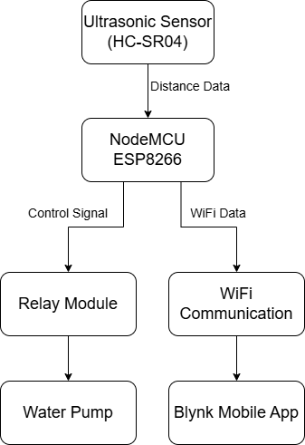
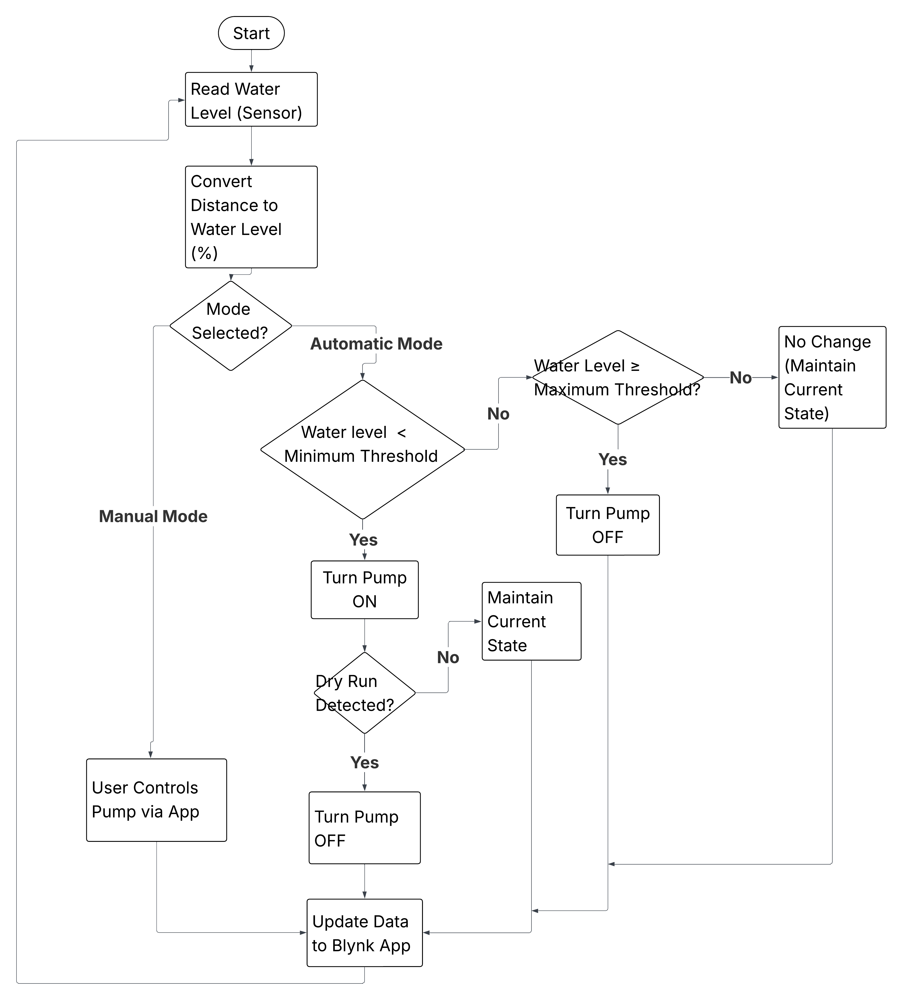
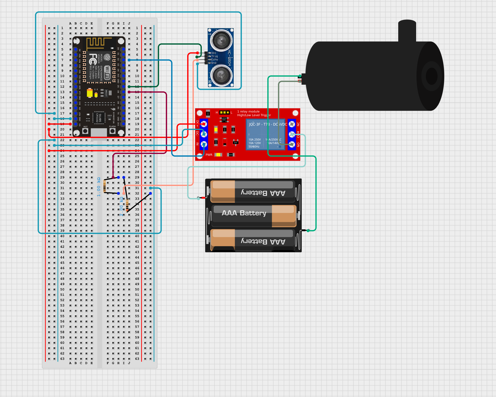

.git# 🚀 Fail-Safe Borewell Pump Automation System

## 📌 Overview
Borewell pump systems often operate without proper monitoring, leading to dry-run conditions that damage motors, tank overflows that waste water, and inefficient energy usage. 

This project presents a fail-safe automated system that monitors water levels and intelligently controls pump operation while detecting abnormal conditions in real time.

---

## ⚙️ Key Features

- 🔄 Automatic Pump Control  
- ⚠️ Dry-Run Protection System  
- 📊 Predictive Fill-Time Estimation  
- 📱 Real-Time Monitoring & Remote Control  

---

## 🧠 How It Works

1. Ultrasonic sensor measures water level  
2. NodeMCU processes data and calculates percentage  
3. System compares with threshold values  
4. Pump is automatically controlled via relay  
5. Data is sent to Blynk app for monitoring  
6. Dry-run condition is detected and handled  

---

## 🖼️ System Architecture

### 🔹 Block Diagram

### 🔹 Flowchart

---

## 🔌 Hardware Setup

### 🔹 Circuit Diagram

### 🔹 Actual Prototype

---

## 📱 Mobile Application (Blynk)

---

## 🛠️ Tech Stack

- NodeMCU ESP8266  
- Ultrasonic Sensor (HC-SR04)  
- Relay Module  
- Blynk IoT Platform  
- Arduino IDE  

---

## 📊 Additional Features

- Pump runtime tracking  
- Pump cycle counting  
- Sensor noise filtering (median + smoothing)  

---

## 🚧 Future Improvements

- Multi-tank support  
- Advanced sensors for higher accuracy  
- Offline data logging  

---

## 📁 Project Structure
fail-safe-borewell-pump-system/
│
├── code/
├── images/
├── README.md

---

## 📌 Conclusion

This project demonstrates how IoT and embedded systems can be combined to create a reliable and intelligent water management solution, reducing manual effort and preventing system failures.